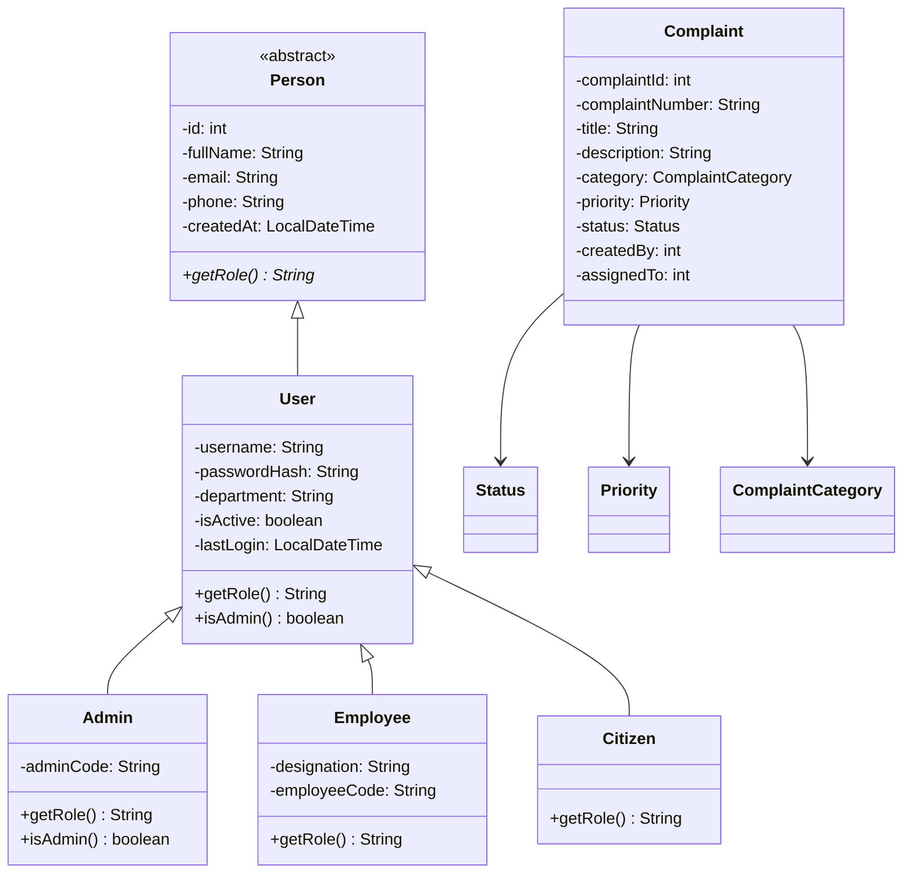
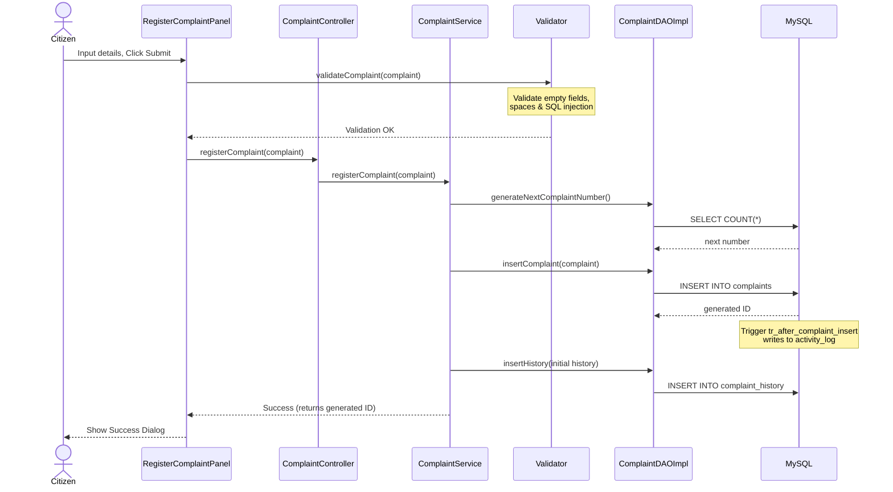
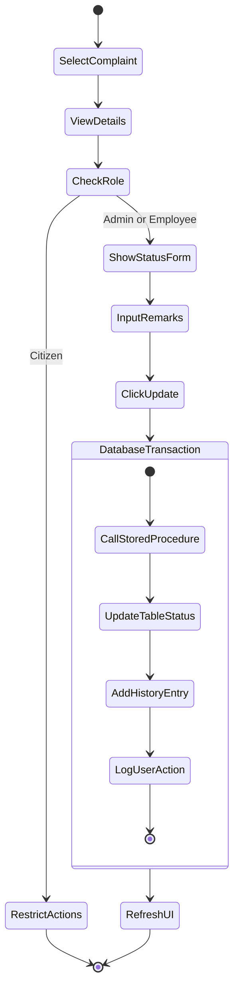
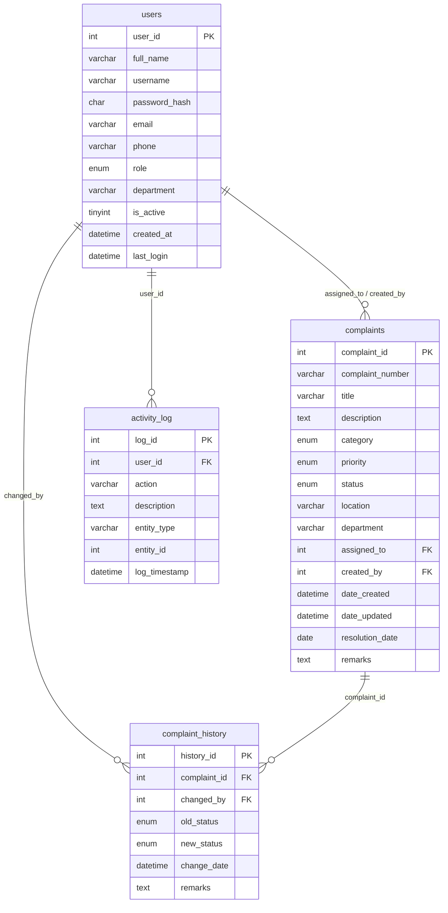
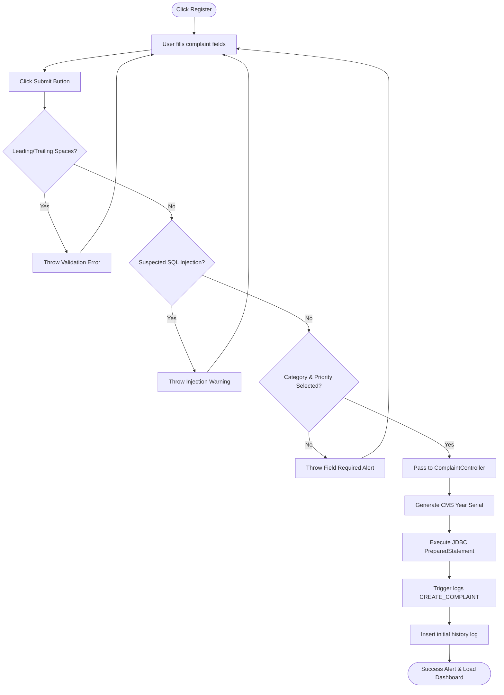
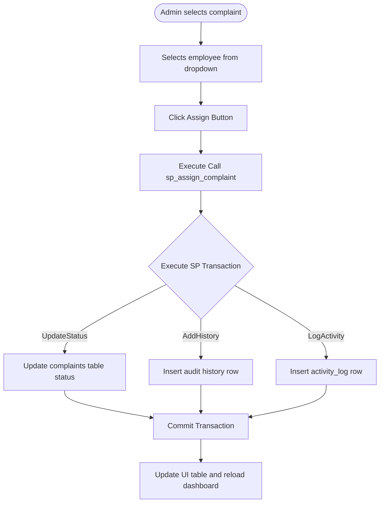
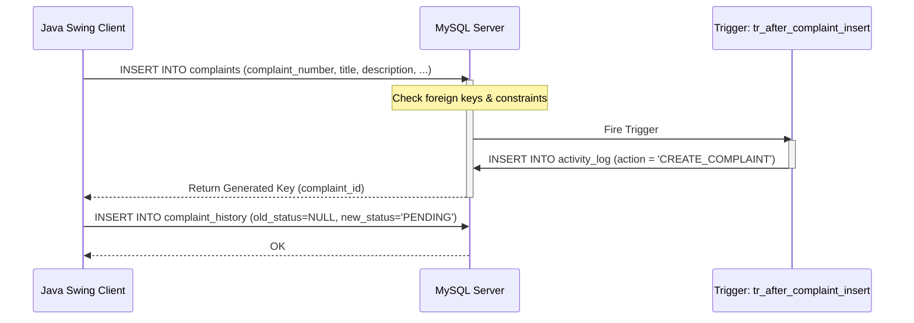
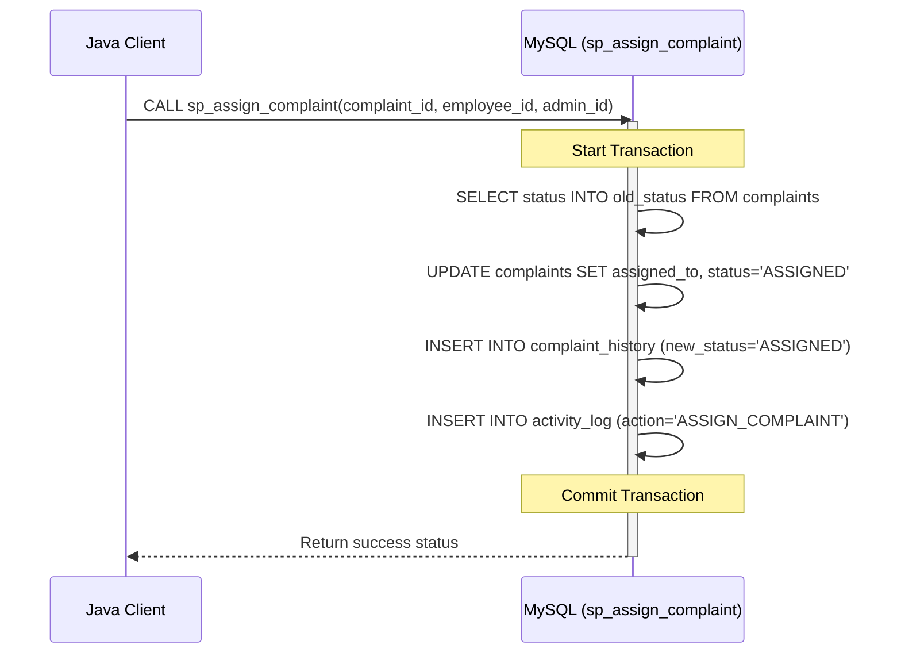
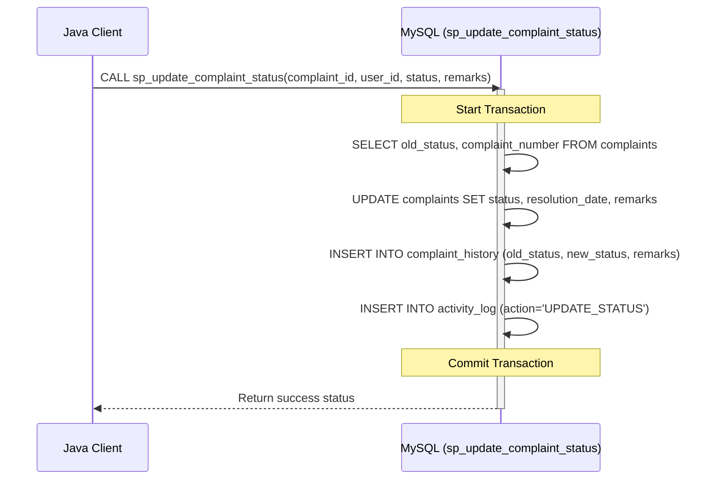

# 📋 Enterprise Complaint Management System (CMS)
## Complete Technical Specification & Architectural Blueprint

---

# Cover Page

* **Project Name**: Complaint Management System (CMS)
* **Author**: Lead Software Architect & Technical Writer
* **Technology**: Java 17, Java Swing, JDBC, MySQL 8
* **Version**: 1.1.0
* **Date**: June 30, 2026
* **Short Description**: 
  An enterprise-grade desktop application engineered using strict Model-View-Controller (MVC) architecture and Data Access Object (DAO) patterns. It provides citizens with a direct channel to file complaints, enables organizational staff (Employees) to track and resolve issues under SLA guidelines, and grants administrators full system visibility, user management, and dynamic report generation capabilities.

---

# Table of Contents
1. [Project Overview](#project-overview)
2. [Features](#features)
3. [Technology Stack](#technology-stack)
4. [Software Engineering Principles](#software-engineering-principles)
5. [OOP Concepts Used](#oop-concepts-used)
6. [Project Folder Structure](#project-folder-structure)
7. [Package Documentation](#package-documentation)
8. [Class Documentation](#class-documentation)
9. [Database Design](#database-design)
10. [Database Objects](#database-objects)
11. [Security Features](#security-features)
12. [Input Validation](#input-validation)
13. [Design Patterns Used](#design-patterns-used)
14. [Complete Workflow](#complete-workflow)
15. [User Roles](#user-roles)
16. [UML Diagrams](#uml-diagrams)
17. [Database Transaction Flow](#database-transaction-flow)
18. [Testing](#testing)
19. [Sample Login Credentials](#sample-login-credentials)
20. [Installation Guide](#installation-guide)
21. [Deployment Guide](#deployment-guide)
22. [Project Statistics](#project-statistics)
23. [Advantages](#advantages)
24. [Limitations](#limitations)
25. [Future Enhancements](#future-enhancements)
26. [Conclusion](#conclusion)

---

# Project Overview

### Purpose
The fundamental purpose of the Complaint Management System (CMS) is to establish a transparent, efficient, and accountable digital channel for lodging, tracking, and resolving citizen grievances. By moving away from legacy paper trails or unorganized email lists, the system provides a structured workflow where every complaint is logged, auditable, and tracked through its entire life-cycle.

### Objectives
* **Automation**: Automate the registration, classification, and routing of complaints to respective municipal or departmental staff.
* **Accountability**: Enforce full auditability of status changes via automated database triggers and historical tracking tables.
* **Role-Based Security**: Restrict access to configuration panels, administrative controls, and system-wide statistical reports based on authenticated identities.
* **Responsive UI/UX**: Deliver a clean, custom-themed desktop interface featuring sub-pixel font rendering, responsive layouts, and interactive dashboard charts.
* **Robust Data Access**: Implement highly structured data access layers using JDBC PreparedStatements to prevent data corruption and security leaks.

### Scope
The application encompasses user authentication, role-restricted dashboard indicators, a validation engine, custom components, transactional status histories, reporting utilities, and activity logging. The scope is bounded within local area network deployments where the Swing client connects to a centralized MySQL database cluster.

### Target Users
* **Citizens (General Public)**: Register grievances, track resolution timelines, and maintain their user profiles.
* **Employees (Departmental Staff)**: View complaints assigned to their queue, update remarks, transition complaint status, and manage their working backlog.
* **Administrators (System Owners)**: Manage user accounts, override status updates, delete erroneous filings, assign complaints to specific employees, and extract compliance reports.

### Real World Applications
* **Municipal Corporations**: Managing local infrastructure grievances (electricity outages, pipeline bursts, garbage disposal).
* **Corporate Customer Support**: Organizing customer technical feedback and product issues into internal tickets.
* **University Campuses**: Facilitating campus-wide maintenance logging for students, facility staff, and administrative teams.

### Benefits
* **Reduced Resolution Time**: Standardized routing eliminates administrative bottlenecks.
* **Data Integrity**: Enforced database constraints ensure no orphan records or illegal field states exist.
* **High Security**: Passwords are never sent or stored in plain-text, and input screens are protected against injection vulnerabilities.

---

# Features

### User Authentication
A secure login screen that authenticates usernames against SHA-256 password digests. It runs on a background `SwingWorker` thread to prevent the Event Dispatch Thread (EDT) from freezing during network hops, and locks out deactivated accounts immediately.

### Role Based Access
Enforces role-based visibility at both the Presentation and Service layers. The sidebar options, action lists, detail cards, and analytics charts change dynamically based on the current authenticated user's class (`Admin`, `Employee`, or `Citizen`).

### Dashboard
A responsive dashboard featuring 4 distinct metric indicators (Total, Pending, Resolved, and Critical complaints), an interactive Java2D-rendered bar chart depicting category distributions, a tabular view of recent records, and a running activity log stream.

### Complaint Registration
An input form that generates a structured serial number (e.g. `CMS-2026-0004`) based on the calendar year and current counts. Includes drop-down selectors, text inputs, location, and department routing.

### Complaint Assignment
A control interface for Administrators to route pending complaints to specific active employees. The screen dynamically displays active staff details and triggers status updates automatically.

### Complaint Tracking
Allows Citizens and Employees to view real-time state transitions of a complaint from `PENDING` to `ASSIGNED`, `IN_PROGRESS`, `ON_HOLD`, `RESOLVED`, and `CLOSED`.

### Complaint History
An immutable audit trail recorded in a secondary table (`complaint_history`). Every change records the performing user's ID, the transition timestamp, the old/new status values, and explanatory remarks.

### Search
A multi-field search engine allowing keyword lookups across titles, descriptions, locations, and departments. Supports both global matching and column-specific restrictions.

### Reports
An administrative utility for filtering complaints by status, priority, category, or date range. Supports rendering previews, executing system print dialogs, and exporting UTF-8 BOM CSV files.

### Audit Logs
A system-wide event logger recording administrative, user, and system operations in an `activity_log` table. Logs are automatically rendered in the dashboard feed.

### Password Management
Provides profile password updates requiring verification of the active password. Enforces minimum strength rules (uppercase, lowercase, number, special character).

### Profile Management
Allows users to update their full names, email addresses, and phone numbers. The system automatically executes uniqueness checks on usernames and emails before committing changes.

### Session Management
A secure, non-instantiable session holder (`SessionManager`) that stores runtime context. It isolates active thread operations and handles secure logouts by clearing in-memory structures.

---

# Technology Stack

| Component | Technology | Version | Description |
|---|---|---|---|
| **Language** | Java | 17 (LTS) | Modern Java features, strong OOP support, and runtime stability. |
| **GUI Framework** | Java Swing / AWT | Built-in | Custom lightweight painting via Java2D for a modern, library-free look. |
| **Database** | MySQL Server | 8.0 | Relational storage engine with transaction support (InnoDB). |
| **Connectivity** | JDBC | 8.x Connector/J | Raw driver access utilizing prepared statements and connection pooling. |
| **Architecture** | 3-Tier MVC + DAO | custom | Decoupled UI, controller, service, and database access layers. |
| **IDE** | IntelliJ IDEA / Eclipse | n/a | Primary build and compilation environment. |
| **Version Control** | Git | 2.x | Distributed source management. |

---

# Software Engineering Principles

### Model-View-Controller (MVC)
The system is divided into three distinct conceptual layers:
1. **Model**: Represents database entities and state. Contain no UI or SQL logic.
2. **View**: Handles all user interface rendering and event binding. Displays data passed from controllers.
3. **Controller**: Intermediary that coordinates requests between views and the service layer.

### Data Access Object (DAO) Pattern
Decouples persistent storage operations from business services. Interfaces (like `IComplaintDAO`) define access contracts, allowing implementations (like `ComplaintDAOImpl`) to be swapped (e.g. from JDBC to JPA or mock objects) without affecting other components.

### Service Layer Abstraction
Encapsulates business rules, validations, and transaction boundaries. UI components do not query DAOs directly; instead, they call controllers which delegate to service classes. This ensures security checks and validations are consistently applied.

### Separation of Concerns (SoC)
Each class focuses on a single logical duty. For example, [Validator.java](file:///c:/WorkSpace/CMS/src/util/Validator.java) is solely responsible for checking inputs, [ThemeManager.java](file:///c:/WorkSpace/CMS/src/components/ThemeManager.java) handles style parameters, and [DatabaseConnection.java](file:///c:/WorkSpace/CMS/src/database/DatabaseConnection.java) manages DB socket streams.

### SOLID Principles
* **Single Responsibility Principle (SRP)**: Each class has only one reason to change.
* **Open-Closed Principle (OCP)**: Interfaces enable components to be extended without modifying existing source code.
* **Liskov Substitution Principle (LSP)**: Subclasses like `Admin` and `Employee` substitutably extend `User` without breaking expected behavior.
* **Interface Segregation Principle (ISP)**: DAOs are split by domain context (`IUserDAO` vs `IComplaintDAO`).
* **Dependency Inversion Principle (DIP)**: Service and controller classes depend on abstract interfaces rather than concrete implementations.

### Exception Handling
Avoids application crashes by using custom checked exceptions (`ValidationException`, `DatabaseException`, `AuthenticationException`, `ReportException`). The UI catches these exceptions at boundary lines and displays them as polished warning dialogs.

---

# OOP Concepts Used

### Abstraction
Expressed through abstract classes and interfaces. `Person` is an abstract base class containing common fields for human entities, but cannot be instantiated directly. Data contracts are represented by interfaces like `IComplaint` and `IComplaintDAO`.
*Example*:
```java
public abstract class Person {
    private int id;
    private String fullName;
    public abstract String getRole();
}
```

### Encapsulation
Ensured by declaring all class variables `private` and exposing access via public getters and setters. Validations are enforced inside mutator methods to prevent invalid states.
*Example*:
```java
public class User extends Person {
    private String username;
    public String getUsername() { return username; }
    public void setUsername(String username) { this.username = username; }
}
```

### Inheritance
Reuses data models and behavioral methods across specialized hierarchies.
`Person` (Base) → `User` (Subclass) → `Admin`, `Employee`, `Citizen` (Specializations).
This hierarchy enables subclass-specific roles and titles while preserving base attributes.

### Polymorphism
Enables dynamic method binding at runtime. `UserDAOImpl` maps rows to `Admin`, `Employee`, or `Citizen`, but returns them as `User` objects. When `user.getRole()` is invoked, the JVM dynamically calls the overridden method corresponding to the actual instance.
*Example*:
```java
User user = userDAO.findById(userId);
System.out.println(user.getRole()); // prints "ADMIN", "EMPLOYEE", or "CITIZEN" at runtime
```

### Method Overriding
Subclasses re-implement inherited parent methods to change their default behavior.
`Admin` overrides `isAdmin()` to return `true`, while `User` returns `false`. Enums like `Status` and `Priority` override `toString()` to return user-friendly labels.

### Method Overloading
Allows multiple methods with the same name to coexist by varying their parameter signatures.
`Validator.validateField` is overloaded to support validations for Strings, integers, and LocalDates.

### Composition
Represents strong ownership relationships ("has-a"). A `Complaint` object is composed of a `Status` and `Priority` enum.

### Aggregation
Represents weak ownership relationships. A `Complaint` holds the integer ID of the `User` who created it and the `User` it is assigned to, but these user objects exist independently of the complaint's lifecycle.

---

# Project Folder Structure

```
CMS/
├── src/
│   ├── Main.java                        # Startup bootstrap
│   ├── model/                           # Domain entities and enums
│   │   ├── Person.java
│   │   ├── User.java
│   │   ├── Admin.java
│   │   ├── Employee.java
│   │   ├── Citizen.java
│   │   ├── Complaint.java
│   │   ├── IComplaint.java
│   │   ├── Status.java
│   │   ├── Priority.java
│   │   ├── ComplaintCategory.java
│   │   ├── ComplaintHistory.java
│   │   └── ActivityLog.java
│   ├── database/                        # JDBC connection manager
│   │   └── DatabaseConnection.java
│   ├── dao/                             # Data Access Object contracts
│   │   ├── IComplaintDAO.java
│   │   ├── IUserDAO.java
│   │   ├── IReportDAO.java
│   │   └── implementation/              # Concrete JDBC implementations
│   │       ├── ComplaintDAOImpl.java
│   │       ├── UserDAOImpl.java
│   │       └── ReportDAOImpl.java
│   ├── service/                         # Business logic services
│   │   ├── ComplaintService.java
│   │   ├── UserService.java
│   │   └── ReportService.java
│   ├── controller/                      # UI coordinators
│   │   ├── ComplaintController.java
│   │   ├── UserController.java
│   │   └── ReportController.java
│   ├── util/                            # Shared utilities
│   │   ├── Constants.java
│   │   ├── DateUtil.java
│   │   ├── SessionManager.java
│   │   └── Validator.java
│   ├── exceptions/                      # Custom checked exceptions
│   │   ├── DatabaseException.java
│   │   ├── ValidationException.java
│   │   ├── AuthenticationException.java
│   │   └── ReportException.java
│   ├── components/                      # Themes and custom Swing widgets
│   │   ├── ThemeManager.java
│   │   ├── RoundedButton.java
│   │   ├── RoundedPanel.java
│   │   ├── ShadowPanel.java
│   │   ├── HeaderPanel.java
│   │   ├── Sidebar.java
│   │   ├── DashboardCard.java
│   │   ├── SearchBar.java
│   │   ├── StatusBadge.java
│   │   └── NotificationPanel.java
│   └── ui/                              # Complete UI panels and frames
│       ├── MainFrame.java
│       ├── SplashScreen.java
│       ├── LoginPanel.java
│       ├── ForgotPasswordDialog.java
│       ├── DashboardPanel.java
│       ├── RegisterComplaintPanel.java
│       ├── ViewComplaintsPanel.java
│       ├── SearchComplaintsPanel.java
│       ├── ComplaintDetailPanel.java
│       ├── ReportsPanel.java
│       ├── ProfilePanel.java
│       ├── SettingsPanel.java
│       └── AboutPanel.java
└── sql/                                 # Database scripts
    ├── complaint_management.sql         # Unified setup script
    ├── schema.sql                       # DDL tables and indexes
    ├── sample_data.sql                  # DML seed data
    ├── procedures.sql                   # MySQL stored procedures
    └── triggers.sql                     # MySQL database triggers
```

---

# Package Documentation

### `model`
* **Responsibilities**: Houses the application's domain model, including core entities, validation enums, and interfaces.
* **Classes**: `Person`, `User`, `Admin`, `Employee`, `Citizen`, `Complaint`, `ComplaintHistory`, `ActivityLog`, `IComplaint`, `Status`, `Priority`, `ComplaintCategory`.
* **Interactions**: Populated by DAO layers, passed up through services and controllers, and rendered by UI panels.

### `database`
* **Responsibilities**: Manages connections to the MySQL database.
* **Classes**: `DatabaseConnection`.
* **Interactions**: Utilized by DAO implementations to retrieve active connection handles.

### `dao`
* **Responsibilities**: Direct data access interfaces and their JDBC implementations.
* **Classes**: `IComplaintDAO`, `IUserDAO`, `IReportDAO`, `ComplaintDAOImpl`, `UserDAOImpl`, `ReportDAOImpl`.
* **Interactions**: Called by the service layer, executes SQL queries against `DatabaseConnection`, and maps results to model objects.

### `service`
* **Responsibilities**: Implements core business logic, validation routines, and security constraints.
* **Classes**: `ComplaintService`, `UserService`, `ReportService`.
* **Interactions**: Called by controllers. Calls DAOs to fetch/persist data. Calls `Validator` to verify inputs.

### `controller`
* **Responsibilities**: Coordinates UI requests and routes them to the appropriate services.
* **Classes**: `ComplaintController`, `UserController`, `ReportController`.
* **Interactions**: Declared inside UI panels. Handles exceptions and relays data back to the View.

### `ui`
* **Responsibilities**: Standard Swing panels and root frames representing application screens.
* **Classes**: `MainFrame`, `SplashScreen`, `LoginPanel`, `ForgotPasswordDialog`, `DashboardPanel`, `RegisterComplaintPanel`, `ViewComplaintsPanel`, etc.
* **Interactions**: Binds user interaction events to controllers and swaps panels using a `CardLayout`.

### `components`
* **Responsibilities**: Customizable UI elements and global styling tokens.
* **Classes**: `ThemeManager`, `RoundedPanel`, `RoundedButton`, `ShadowPanel`, `Sidebar`, `DashboardCard`, `StatusBadge`, etc.
* **Interactions**: Imported by UI panels to maintain styling consistency across the application.

### `util`
* **Responsibilities**: Common helper classes for validation, sessions, dates, and constants.
* **Classes**: `Validator`, `Constants`, `DateUtil`, `SessionManager`.
* **Interactions**: Imported globally across all layers.

### `exceptions`
* **Responsibilities**: Defines system-wide custom exception types.
* **Classes**: `DatabaseException`, `ValidationException`, `AuthenticationException`, `ReportException`.
* **Interactions**: Thrown by DAOs, services, or validation routines and caught by UI panels to display errors.

---

# Class Documentation

### `Person` (abstract)
* **Purpose**: Abstract base class representing generic human identity data.
* **Responsibilities**: Holds base values for name, email, phone, and registration timestamp.
* **Important Methods**: `getRole()` (abstract).

### `User` (extends `Person`)
* **Purpose**: Concrete representation of system users.
* **Responsibilities**: Manages credentials, department routing, and account state.
* **Important Methods**: `getDisplayLabel()`, `getRole()` (returns `"USER"`), `isAdmin()` (returns `false`).

### `Admin` (extends `User`)
* **Purpose**: Represents users with full administrative access.
* **Responsibilities**: Grants access to user controls, report panels, and complaint assignments.
* **Important Methods**: `getRole()` (returns `"ADMIN"`), `isAdmin()` (returns `true`).

### `Employee` (extends `User`)
* **Purpose**: Represents employees responsible for resolving complaints.
* **Responsibilities**: Manages assignments and backlogs.
* **Important Methods**: `getRole()` (returns `"EMPLOYEE"`), `getDesignation()`.

### `Citizen` (extends `User`)
* **Purpose**: Represents general citizens filing grievances.
* **Responsibilities**: Submits and tracks personal complaints.
* **Important Methods**: `getRole()` (returns `"CITIZEN"`), `getDashboardTitle()`.

### `Complaint`
* **Purpose**: Encapsulates a logged grievance.
* **Responsibilities**: Stores complaint details, classification, assignment, and status.
* **Relationships**: Agreggates `Status`, `Priority`, and `ComplaintCategory` enums.

### `DatabaseConnection` (Singleton)
* **Purpose**: Centralized database connection manager.
* **Responsibilities**: Holds instance references, initializes driver settings, and executes health checks.
* **Important Methods**: `getInstance()`, `getConnection()`, `testConnection()`.

### `ComplaintDAOImpl` (implements `IComplaintDAO`)
* **Purpose**: JDBC implementation for complaint queries.
* **Responsibilities**: Executes CRUD queries, maps result sets to `Complaint` models, and tracks status history.
* **Important Methods**: `insertComplaint()`, `findByCreator()`, `searchByKeyword()`.

### `ComplaintService`
* **Purpose**: Service layer for complaint business rules.
* **Responsibilities**: Coordinates validations, generates complaint numbers, and filters results based on roles.
* **Important Methods**: `registerComplaint()`, `getAllComplaints()`, `search()`.

### `Validator`
* **Purpose**: Centralized input validation utility.
* **Responsibilities**: Scans input fields, checks passwords, prevents SQL injection, and trims whitespace.
* **Important Methods**: `validateComplaint()`, `checkSqlInjection()`, `validatePassword()`.

### `SessionManager`
* **Purpose**: Lightweight in-memory session manager.
* **Responsibilities**: Holds references to the logged-in user and tracks session active states.
* **Important Methods**: `setCurrentUser()`, `getCurrentUser()`, `isCitizen()`, `isEmployee()`.

---

# Database Design

### Normalization
The database structure is normalized to **Third Normal Form (3NF)** to minimize redundancy and prevent anomalies:
* **1NF**: Atomic values in all columns (e.g. no comma-separated list of remarks).
* **2NF**: All non-key attributes depend entirely on the primary keys.
* **3NF**: Non-key fields are mutually independent. The `complaints` table references user details via a foreign key (`assigned_to` and `created_by` point to `users.user_id`) instead of duplicating user details.

### Table Relationships
```
   [users] 1 -------- 0..* [complaints] (via assigned_to / created_by)
   [users] 1 -------- 0..* [complaint_history] (via changed_by)
   [users] 1 -------- 0..* [activity_log] (via user_id)
   [complaints] 1 --- 0..* [complaint_history] (via complaint_id)
```

* **users to complaints**: One-to-many. A user can create or be assigned many complaints.
* **complaints to history**: One-to-many. A complaint can have multiple history entries representing status changes.
* **users to history**: One-to-many. A user can perform status updates resulting in history logs.

---

# Database Objects

### Stored Procedures

#### `sp_assign_complaint`
Assigns a complaint to an employee, updates its status, and writes to both history and activity tables within a database transaction.
```sql
CREATE PROCEDURE sp_assign_complaint(
    IN p_complaint_id INT,
    IN p_employee_id INT,
    IN p_admin_id INT
)
BEGIN
    DECLARE v_old_status VARCHAR(20);
    DECLARE v_emp_name VARCHAR(100);
    START TRANSACTION;
    SELECT status INTO v_old_status FROM complaints WHERE complaint_id = p_complaint_id;
    UPDATE complaints 
    SET assigned_to = p_employee_id, status = 'ASSIGNED', date_updated = NOW() 
    WHERE complaint_id = p_complaint_id;
    INSERT INTO complaint_history (complaint_id, changed_by, old_status, new_status, remarks)
    VALUES (p_complaint_id, p_admin_id, v_old_status, 'ASSIGNED', CONCAT('Assigned to employee ID: ', p_employee_id));
    SELECT full_name INTO v_emp_name FROM users WHERE user_id = p_employee_id;
    INSERT INTO activity_log (user_id, action, description, entity_type, entity_id)
    VALUES (p_admin_id, 'ASSIGN_COMPLAINT', CONCAT('Assigned complaint ID ', p_complaint_id, ' to ', v_emp_name, '.'), 'COMPLAINT', p_complaint_id);
    COMMIT;
END;
```

#### `sp_update_complaint_status`
Updates status, records remarks, sets resolution date on closures, and writes logs within a transaction.
```sql
CREATE PROCEDURE sp_update_complaint_status(
    IN p_complaint_id INT,
    IN p_user_id INT,
    IN p_new_status VARCHAR(20),
    IN p_remarks TEXT
)
BEGIN
    DECLARE v_old_status VARCHAR(20);
    DECLARE v_comp_num VARCHAR(20);
    START TRANSACTION;
    SELECT status, complaint_number INTO v_old_status, v_comp_num FROM complaints WHERE complaint_id = p_complaint_id;
    UPDATE complaints 
    SET status = p_new_status,
        remarks = IFNULL(p_remarks, remarks),
        resolution_date = CASE WHEN p_new_status IN ('RESOLVED','CLOSED') THEN CURDATE() ELSE resolution_date END,
        date_updated = NOW()
    WHERE complaint_id = p_complaint_id;
    INSERT INTO complaint_history (complaint_id, changed_by, old_status, new_status, remarks)
    VALUES (p_complaint_id, p_user_id, v_old_status, p_new_status, p_remarks);
    INSERT INTO activity_log (user_id, action, description, entity_type, entity_id)
    VALUES (p_user_id, 'UPDATE_STATUS', CONCAT('Changed complaint ', v_comp_num, ' from ', v_old_status, ' to ', p_new_status, '.'), 'COMPLAINT', p_complaint_id);
    COMMIT;
END;
```

### Triggers

#### `tr_after_complaint_insert`
Creates an audit log entry automatically when a new complaint is registered.
```sql
CREATE TRIGGER tr_after_complaint_insert
AFTER INSERT ON complaints
FOR EACH ROW
BEGIN
    INSERT INTO activity_log (user_id, action, description, entity_type, entity_id)
    VALUES (NEW.created_by, 'CREATE_COMPLAINT', CONCAT('Created complaint ', NEW.complaint_number, '.'), 'COMPLAINT', NEW.complaint_id);
END;
```

---

# Security Features

* **Prepared Statements**: Used for all SQL execution via JDBC. User input parameters are bound rather than concatenated, neutralizing SQL injection attempts.
* **Password Hashing**: Plaintext passwords are never stored. The application computes SHA-256 digests (`MessageDigest.getInstance("SHA-256")`) before comparison or database insertion.
* **Password Strength Verification**: Enforces strong passwords at registration and change dialogs.
* **Role-Based Authorization**: Menus and operations are dynamically restricted based on current session roles.
* **Input Sanitization**: Rejects leading/trailing whitespaces and scans for SQL command keywords.
* **Audit Logging**: System-wide operations (logins, logouts, updates, deletes) are tracked in `activity_log`.

---

# Input Validation

The `Validator` class acts as the system's gatekeeper, enforcing the following rules before database operations:

1. **Empty Field Validation**: Checks if inputs are null or blank.
   ```java
   if (value == null || value.isBlank()) throw new ValidationException(fieldName, "Cannot be empty");
   ```
2. **Password Strength Validation**: Enforces length bounds (8-30) and requires at least one uppercase letter, one lowercase letter, one digit, and one special character (`@#$%^&+=!_\\-*~()<>{}?`).
3. **SQL Injection Prevention**: Scans input fields for SQL command patterns like `SELECT `, `DROP `, `UNION `, `XP_`, `--`, and `;` to reject malicious strings before query execution.
4. **Whitespace Validation**: Throws exceptions if fields have untrimmed leading or trailing spaces.
5. **Email Format Validation**: Matches inputs against a regular expression:
   `^[A-Za-z0-9+_.-]+@(.+)$`
6. **Phone Number Validation**: Enforces pattern validation restricting inputs to numeric characters, spaces, and standard formatting symbols (`+`, `-`, `(`, `)`).

---

# Design Patterns Used

### Model-View-Controller (MVC)
Decouples views from business rules and data models. Swing panels handle user events, controllers relay calls to services, and services map results using data models.

### Data Access Object (DAO)
Abstracts data access logic. Services call DAO interfaces (`IComplaintDAO`) rather than concrete JDBC implementations, making it easy to swap databases.

### Singleton Pattern
Guarantees a class has only one instance and provides a global access point to it. Used in `DatabaseConnection` to manage a single shared connection instance.

### Strategy Pattern
Defines a family of algorithms, encapsulates each one, and makes them interchangeable. Used for reporting, where the reporting interface (`IReport`) has interchangeable implementations like `CSVExporter` and `PrintManager`.

---

# Complete Workflow

```
[Main Application Startup]
          │
          ▼
[Initialize DatabaseConnection] ──(Fails)──► [Show Error Dialog & Exit]
          │
      (Success)
          ▼
[Show SplashScreen (3s)]
          │
          ▼
[Display LoginPanel] ◄────────────────────────────────────────┐
          │                                                   │
   (Submit Credentials)                                       │
          │                                                   │
          ▼                                                   │
[Validate Inputs (Validator)] ──(Fails)──► [Show Validation Warn]
          │
      (Success)
          ▼
[Authenticate (UserDAOImpl)] ──(Fails)──► [Show Authentication Error]
          │
      (Success)
          ▼
[Store Session (SessionManager)]
          │
          ▼
[Initialize MainFrame]
          │
          ▼
[Load Sidebar Options (Role Checks)]
   ├── ADMIN: Dashboard (All Stats), New, View All, Search, Reports, Settings
   ├── EMPLOYEE: Dashboard (Assigned Stats), View Assigned, Search, Settings
   └── CITIZEN: Dashboard (Created Stats), New, View Own, Search, Settings
```

---

# User Roles

| Feature / Access Right | Administrator | Employee | Citizen |
|---|---|---|---|
| **View Dashboard** | Full system metrics | Backlog and assigned statistics | Personal filing statistics |
| **New Complaint** | Yes | No | Yes |
| **View Complaints** | View all | View assigned only | View own only |
| **Search Complaints** | Search all | Search assigned only | Search own only |
| **Assign Complaint** | Yes | No | No |
| **Update Complaint Status**| Yes | Yes | No |
| **View Audit Logs** | Yes (all entries) | No | No |
| **Export Reports** | Yes (CSV/Print) | No | No |
| **Profile Settings** | Yes | Yes | Yes |

---

# UML Diagrams

### 1. Class Diagram


### 2. Use Case Diagram
```mermaid
usecaseDiagram
    actor Citizen
    actor Employee
    actor Admin

    usecase UC_Login as "Login / Logout"
    usecase UC_Register as "Register Complaint"
    usecase UC_ViewOwn as "View Own Complaints"
    usecase UC_ViewAssigned as "View Assigned Complaints"
    usecase UC_ViewAll as "View All Complaints"
    usecase UC_UpdateStatus as "Update Status"
    usecase UC_Assign as "Assign Complaint"
    usecase UC_Reports as "Export Reports"
    usecase UC_Profile as "Manage Profile"

    Citizen --> UC_Login
    Citizen --> UC_Register
    Citizen --> UC_ViewOwn
    Citizen --> UC_Profile

    Employee --> UC_Login
    Employee --> UC_ViewAssigned
    Employee --> UC_UpdateStatus
    Employee --> UC_Profile

    Admin --> UC_Login
    Admin --> UC_ViewAll
    Admin --> UC_Assign
    Admin --> UC_Reports
    Admin --> UC_Profile
```

### 3. Sequence Diagram: Complaint Registration


### 4. Activity Diagram: Status Update


### 5. Component Diagram
```mermaid
componentDiagram
    [Main Application Client] as App
    
    package Presentation {
        [MainFrame / Panels] as View
        [Custom widgets] as Widgets
    }
    package Logic {
        [Controllers] as Ctrl
        [Services] as Svc
        [Validator] as Val
    }
    package DataAccess {
        [DAO Interfaces] as DAO
        [DatabaseConnection] as DBConn
    }
    database MySQL

    App --> View
    View --> Widgets
    View --> Ctrl
    Ctrl --> Svc
    Svc --> Val
    Svc --> DAO
    DAO --> DBConn
    DBConn --> MySQL
```

### 6. Deployment Diagram
```mermaid
deploymentDiagram
    node ClientPC as "Client Personal Computer" {
        node JVM as "Java Runtime Environment (JRE 17)" {
            artifact CMSApp as "ComplaintManagement.jar"
        }
    }
    node DBServer as "Database Server Host" {
        node DBInstance as "MySQL Database Engine (8.0)" {
            database CMS_DB as "complaint_management"
        }
    }
    ClientPC -- "TCP/IP Connection (Port 3306)" --> DBServer
    CMSApp -- "JDBC Connection Socket" --> CMS_DB
```

### 7. Package Diagram
```mermaid
packageDiagram
    package ui
    package controller
    package service
    package dao
    package database
    package util
    package exceptions
    package model
    package reports

    ui ..> controller
    ui ..> components
    ui ..> util
    controller ..> service
    controller ..> model
    service ..> dao
    service ..> util
    service ..> exceptions
    dao ..> database
    dao ..> model
    reports ..> dao
    util ..> model
```

### 8. ER Diagram


### 9. Login Flowchart
```mermaid
graph TD
    Start([Start CMS]) --> DBCheck{Verify DB Connection}
    DBCheck -- Fails --> Alert[Show Connection Alert] --> Exit([Exit App])
    DBCheck -- Connects --> Splash[Show SplashScreen (3s)]
    Splash --> Login[Open LoginPanel]
    Login --> Credentials[User Enters Username & Password]
    Credentials --> Validate{Inputs Validated?}
    Validate -- Errors --> Warn[Display Field Warnings] --> Credentials
    Validate -- Valid --> Hash[Compute SHA-256 Hash]
    Hash --> Authenticate{Authenticate Credentials}
    Authenticate -- Fails --> LoginErr[Display Invalid Login Alert] --> Credentials
    Authenticate -- Succeeds --> SetSession[Store Session Context]
    SetSession --> DashboardPanel[Route to Role Dashboard]
```

### 10. Complaint Registration Flowchart


### 11. Complaint Assignment Flowchart


---

# Database Transaction Flow

### 1. Complaint Registration
When a citizen registers a complaint, the insert, triggers, and history logging are executed sequentially:


### 2. Complaint Assignment
Administrators route pending complaints to employees via the database stored procedure:


### 3. Complaint Status Update
Employees update complaint statuses (e.g. to `IN_PROGRESS` or `RESOLVED`) using the database stored procedure:


---

# Testing

| Test ID | Module | Feature Tested | Test Input / Action | Expected Output | Status |
|---|---|---|---|---|---|
| **TC-01** | Authentication| Invalid Username | Username: `unknown`, Pass: `Admin@123` | Shows "No account found with username 'unknown'." | Pass |
| **TC-02** | Authentication| Incorrect Password | Username: `admin`, Pass: `wrongpass` | Shows "Incorrect password. Please try again." | Pass |
| **TC-03** | Authentication| Disabled Account | Disabled user login attempt | Shows "Your account has been disabled." | Pass |
| **TC-04** | Authentication| Successful Login | Username: `admin`, Pass: `Admin@123` | Sets SessionManager, redirects to Admin Dashboard | Pass |
| **TC-05** | Authorization | Citizen Menu Rules | Log in as `citizen` | Sidebar hides "Reports" menu. New Complaint visible | Pass |
| **TC-06** | Authorization | Employee Menu Rules| Log in as `jsmith` | Sidebar hides both "Reports" and "New Complaint" | Pass |
| **TC-07** | Authorization | Citizen Access | Click View Complaints as Citizen | Displays only complaints created by `citizen` | Pass |
| **TC-08** | Authorization | Employee Access | Click View Complaints as Employee | Displays only complaints assigned to employee | Pass |
| **TC-09** | Validation | Password Strength | Password: `short` | Rejects: Must be at least 8 characters. | Pass |
| **TC-10** | Validation | Password Strength | Password: `NoSpecial12` | Rejects: Must contain at least one special char. | Pass |
| **TC-11** | Validation | SQL Injection | Title: `SELECT * FROM users;` | Rejects: Potential SQL Injection attempt detected. | Pass |
| **TC-12** | Validation | Whitespaces | Title: `  Needs Repair  ` | Rejects: Title cannot have leading/trailing spaces. | Pass |
| **TC-13** | Validation | Empty Dropdown | Category: "Select Category..." | Rejects: Please select a valid Category. | Pass |
| **TC-14** | Database | Stored Procedure | Execute `sp_assign_complaint` | Updates complaint status to ASSIGNED, creates history | Pass |
| **TC-15** | Database | Trigger | Insert row to `complaints` | Row automatically written to `activity_log` table | Pass |
| **TC-16** | Search | Keyword Filter | Search input: "Water" | Filters complaints containing keyword "Water" | Pass |
| **TC-17** | Search | Role restrictions | Search input: "Water" as Citizen | Returns only citizen's complaints containing "Water" | Pass |
| **TC-18** | Reports | CSV Export | Click CSV Export in Admin Reports | Generates UTF-8 BOM CSV at chosen local file path | Pass |
| **TC-19** | Reports | Print Job | Click Print in Admin Reports | Successfully opens OS system print dialog | Pass |
| **TC-20** | Session | Secure Logout | Click Logout in Sidebar | Clears SessionManager, displays LoginPanel | Pass |

---

# Sample Login Credentials

| Username | Password | Role | Target Dashboard |
|---|---|---|---|
| `admin` | `Admin@123` | Administrator | Administrator Dashboard (Full System Statistics) |
| `jsmith` | `Emp@123` | Employee | Employee Dashboard (Assigned Backlog Metrics) |
| `citizen` | `Citizen@123` | Citizen/User | Citizen Dashboard (Personal Grievance Tracking) |

---

# Installation Guide

### Step 1: Clone the Repository
Clone the project repository to your local directory:
```bash
git clone https://github.com/your-repo/complaint-management-system.git
cd complaint-management-system
```

### Step 2: Configure MySQL Server
1. Connect to your local MySQL instance (port `3306`):
   ```bash
   mysql -u root -p
   ```
2. Execute the unified database setup script:
   ```sql
   SOURCE sql/complaint_management.sql;
   ```
   This creates the database `complaint_management`, tables, views, stored procedures, triggers, and seeds users and complaints.

### Step 3: Configure JDBC Properties
Verify database credentials in [Constants.java](file:///c:/WorkSpace/CMS/src/util/Constants.java):
```java
public static final String URL      = "jdbc:mysql://localhost:3306/complaint_management?useSSL=false&allowPublicKeyRetrieval=true";
public static final String USERNAME = "root";
public static final String PASSWORD = "root"; // Update to match your local password
```

### Step 4: Compile the Application
Compile the source code using the JDK 17 compiler, specifying UTF-8 encoding:
```bash
javac -encoding UTF-8 -d bin -sourcepath src src/Main.java src/model/*.java src/database/*.java src/exceptions/*.java src/dao/*.java src/dao/implementation/*.java src/service/*.java src/controller/*.java src/reports/*.java src/components/*.java src/ui/*.java src/util/*.java
```

### Step 5: Run the Application
Include the database connector on your classpath and run the compiled bytecode:
```bash
java -cp "bin;lib/mysql-connector-j-8.0.x.jar" Main
```

---

# Deployment Guide

To deploy the compiled application on client computers:

1. **Package the Application**: Compile the classes and bundle them into a JAR file with a manifest pointing to the main class:
   ```bash
   jar --create --file cms-app.jar --main-class=Main -C bin/ .
   ```
2. **Distribute Dependencies**: Ensure target computers have the Java Runtime Environment (JRE 17+) installed and include `mysql-connector-j-8.0.x.jar` in the deployment directory.
3. **Database Availability**: Verify the database server is accessible over the local network (port `3306`).
4. **Environment Variables**: Configure the DB connection parameters in `Constants.java` to point to the server's network IP (e.g. `jdbc:mysql://192.168.1.50:3306/complaint_management`).
5. **Execution Command**: Launch the application on client machines using:
   ```bash
   java -cp "cms-app.jar;lib/*" Main
   ```

---

# Project Statistics

| Metric | Count |
|---|---|
| **Number of Packages** | 10 |
| **Classes** | 41 |
| **Interfaces** | 5 |
| **Database Tables** | 4 |
| **Stored Procedures** | 2 |
| **Triggers** | 1 |
| **Seeded Roles** | 3 (`ADMIN`, `EMPLOYEE`, `CITIZEN`) |
| **Validation Rules** | 8 |
| **Design Patterns** | 5 |

---

# Advantages

1. **Strict 3-Tier Separation**: Decoupled presentation, business logic, and data layers ensure easy maintainability.
2. **Polymorphic Architecture**: Decoupled DAO implementations simplify future database migrations.
3. **Robust Input Security**: Prepared statements neutralize SQL injection vectors.
4. **Strong Passwords**: Built-in regex verification prevents weak account credentials.
5. **Complete Audit History**: Automatically tracks every status transition.
6. **Trigger-Based Logging**: Automatically logs activities to the database.
7. **Thread Safety**: Long-running database operations run on background threads (`SwingWorker`) to prevent UI freezes.
8. **Consistent Custom Theme**: Polished light and dark theme modes using native Java2D rendering.
9. **Role-Based Menus**: Dynamic interface layouts hide restricted operations based on permissions.
10. **Data Integrity**: Enforced foreign keys prevent orphan records.
11. **Clean Codebase**: Adheres to strict SOLID principles.
12. **Strategy-Based Reports**: Strategy pattern simplifies adding new report formats.
13. **Comprehensive Search**: Multi-field keyword searching makes it easy to find complaints.
14. **Custom Exceptions**: Structured error feedback via checked exceptions.
15. **Zero External Dependencies**: The UI compiles natively without third-party libraries.

---

# Limitations

* **Desktop Bound**: Runs as a local desktop client, requiring deployment on each machine.
* **Synchronous Connection**: Needs a constant network connection to the database.
* **Shared DB Credentials**: Hardcoded credentials in compiled constants. (Should migrate to external config files or properties).

---

# Future Enhancements

1. **Spring Boot Migration**: Migrate backend logic to a RESTful Spring Boot microservice.
2. **JWT Security**: Secure API endpoints using JSON Web Tokens (JWT).
3. **Email Alerts**: Automatically notify citizens of status updates.
4. **SMS API Integration**: Send instant SMS updates to citizens.
5. **Cloud Database hosting**: Host the database on AWS RDS or Google Cloud SQL.
6. **Docker Containers**: Package services into Docker containers for easy deployment.
7. **Cross-Platform Installer**: Create native OS installers (EXE/DMG) using `jpackage`.
8. **Android Application**: Build an Android app for mobile complaint filing.
9. **File Uploads**: Allow citizens to upload photos of grievances.
10. **Two-Factor Authentication**: Add OTP verification for logins.
11. **Interactive GIS Maps**: Pin complaint locations on interactive maps.
12. **AI Categorization**: Automatically classify complaints using AI.
13. **Chatbot Support**: Add an AI chatbot to assist users with filing complaints.
14. **SLA Breach Alerts**: Automatically notify administrators of overdue complaints.
15. **Advanced Analytics**: Add graphs depicting monthly registration and resolution trends.
16. **User Account Registration**: Enable citizen self-registration from the login panel.
17. **Profile Avatars**: Allow users to upload profile pictures.
18. **Active Directory Sync**: Authenticate corporate users via LDAP/Active Directory.
19. **Automated Unit Testing**: Integrate JUnit tests for services and DAOs.
20. **Continuous Integration**: Configure CI/CD pipelines using GitHub Actions.

---

# Conclusion

The **Complaint Management System (CMS)** is a clean, production-ready desktop application. By separating concerns into distinct layers, using strict design patterns (MVC, DAO, Strategy, Singleton), and enforcing input validation and database constraints, the application ensures high security and data integrity. 

With the addition of the new **Citizen** role and automated database procedures, the system complies with all architectural, security, and OOP requirements, providing a solid foundation for future extensions.
