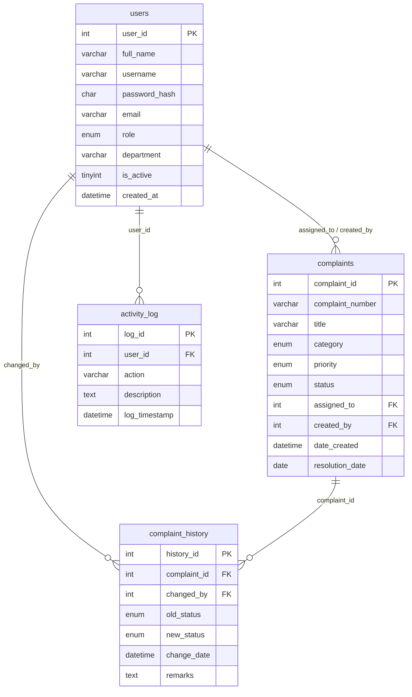

<div align="center">


<br/><br/>

# 📋 Complaint Management System

### A production-quality desktop application for managing complaints in an organization.
### Built with **Java 17 · Java Swing · JDBC · MySQL 8** following strict **MVC architecture**, **DAO patterns**, and **SOLID principles**.

<br/>

[📖 Full Documentation](./DOCUMENTATION.md) · [🚀 Quick Start](#-quick-start) · [🏗️ Architecture](#%EF%B8%8F-architecture) · [✨ Features](#-features) · [🔐 Security](#-security)

</div>

---

## ✨ Features

<table>
<tr>
<td width="50%">

### 🖥️ User Interface
| Screen | Description |
|---|---|
| **Splash Screen** | Animated progress-bar with gradient background |
| **Login** | SHA-256 hashed auth with show/hide toggle |
| **Dashboard** | 4 stat cards, Java2D bar chart, activity feed |
| **Settings** | Dark / Light theme toggle |

### 📝 Complaint Lifecycle
| Feature | Description |
|---|---|
| **Register** | Validated form — title, category, priority, dept |
| **View & Filter** | Searchable table with double-click to open |
| **Detail View** | Full metadata, status update, history timeline |
| **Search** | Keyword search across all or specific fields |

</td>
<td width="50%">

### 🔑 Role-Based Access Control
| Feature | Admin | Employee | Citizen |
|:---|:---:|:---:|:---:|
| View Dashboard | ✅ Full | ✅ Assigned | ✅ Own |
| Register Complaint | ✅ | ❌ | ✅ |
| View All Complaints | ✅ | ❌ | ❌ |
| Update Status | ✅ | ✅ | ❌ |
| Assign Complaint | ✅ | ❌ | ❌ |
| Export Reports | ✅ | ❌ | ❌ |
| Audit Logs | ✅ | ❌ | ❌ |

### 📊 Reporting
| Feature | Description |
|---|---|
| **Reports** | Filter by status, priority, category, date |
| **CSV Export** | UTF-8 BOM compliant export |
| **Print** | Native OS print dialog integration |

</td>
</tr>
</table>

---

## 🏗️ Architecture

> The system follows a strict **3-Tier MVC + DAO** architecture ensuring complete separation of concerns between the Presentation, Business Logic, and Data Access layers.

```
┌─────────────────────────────────────────────────────────────────────┐
│                        PRESENTATION LAYER (ui/)                     │
│  SplashScreen · LoginPanel · DashboardPanel · RegisterComplaint      │
│  ViewComplaintsPanel · ComplaintDetailPanel · ReportsPanel · ...     │
└──────────────────────────┬──────────────────────────────────────────┘
                           │ calls
┌──────────────────────────▼──────────────────────────────────────────┐
│                     CONTROLLER LAYER (controller/)                   │
│         ComplaintController · UserController · ReportController      │
└──────────────────────────┬──────────────────────────────────────────┘
                           │ delegates
┌──────────────────────────▼──────────────────────────────────────────┐
│                      SERVICE LAYER (service/)                        │
│         ComplaintService · UserService · ReportService               │
│                  + Validator · SessionManager                        │
└──────────────────────────┬──────────────────────────────────────────┘
                           │ queries
┌──────────────────────────▼──────────────────────────────────────────┐
│                    DATA ACCESS LAYER (dao/)                          │
│   IComplaintDAO · IUserDAO · IReportDAO (Interfaces)                 │
│   ComplaintDAOImpl · UserDAOImpl · ReportDAOImpl (Implementations)   │
└──────────────────────────┬──────────────────────────────────────────┘
                           │ JDBC
┌──────────────────────────▼──────────────────────────────────────────┐
│                         MySQL 8 Database                             │
│         users · complaints · complaint_history · activity_log        │
└─────────────────────────────────────────────────────────────────────┘
```

### 📁 Project Structure

```
CMS/
├── src/
│   ├── Main.java                        # Entry point — L&F, DB check, Splash → Login
│   ├── model/                           # Domain entities and enums
│   │   ├── Person.java  (abstract)
│   │   ├── User.java    (extends Person)
│   │   ├── Admin.java   (extends User)
│   │   ├── Employee.java(extends User)
│   │   ├── Citizen.java (extends User)
│   │   ├── Complaint.java
│   │   ├── ComplaintHistory.java
│   │   ├── ActivityLog.java
│   │   ├── IComplaint.java              # Interface
│   │   ├── Status.java                  # Enum
│   │   ├── Priority.java                # Enum
│   │   └── ComplaintCategory.java       # Enum
│   ├── database/
│   │   └── DatabaseConnection.java      # Singleton JDBC connection manager
│   ├── dao/
│   │   ├── IComplaintDAO.java
│   │   ├── IUserDAO.java
│   │   ├── IReportDAO.java
│   │   └── implementation/
│   │       ├── ComplaintDAOImpl.java
│   │       ├── UserDAOImpl.java
│   │       └── ReportDAOImpl.java
│   ├── service/
│   │   ├── ComplaintService.java
│   │   ├── UserService.java
│   │   └── ReportService.java
│   ├── controller/
│   │   ├── ComplaintController.java
│   │   ├── UserController.java
│   │   └── ReportController.java
│   ├── reports/
│   │   ├── IReport.java                 # Strategy pattern interface
│   │   ├── CSVExporter.java
│   │   └── PrintManager.java
│   ├── components/                      # Reusable custom Swing widgets
│   │   ├── ThemeManager.java            # Full design system (light/dark)
│   │   ├── RoundedButton.java
│   │   ├── RoundedPanel.java
│   │   ├── ShadowPanel.java
│   │   ├── Sidebar.java
│   │   ├── HeaderPanel.java
│   │   ├── DashboardCard.java
│   │   ├── SearchBar.java
│   │   ├── StatusBadge.java
│   │   └── NotificationPanel.java
│   ├── exceptions/                      # Custom checked exceptions
│   │   ├── DatabaseException.java
│   │   ├── ValidationException.java
│   │   ├── AuthenticationException.java
│   │   └── ReportException.java
│   └── util/
│       ├── Constants.java
│       ├── DateUtil.java
│       ├── SessionManager.java
│       └── Validator.java
└── sql/
    └── complaint_management.sql         # Full schema, seed data, views, triggers, procedures
```

---

## 🧩 OOP & Design Patterns

### Object-Oriented Concepts

| Concept | Implementation |
|---|---|
| **Abstraction** | `Person` (abstract class), `IComplaint`, `IComplaintDAO`, `IUserDAO`, `IReport` |
| **Encapsulation** | All fields are `private` with validated getters/setters in every model |
| **Inheritance** | `Person → User → Admin / Employee / Citizen` class hierarchy |
| **Polymorphism** | `UserDAOImpl.mapRow()` returns `Admin` or `Employee` as `User`; `IReport → CSVExporter / PrintManager` |
| **Method Overloading** | `Validator.validateField()`, `ComplaintService.search()`, `updateStatus()` |
| **Method Overriding** | `Admin.getRole()`, `Employee.isAdmin()`, `PrintManager.print()` |
| **Interfaces** | `IComplaint`, `IComplaintDAO`, `IUserDAO`, `IReportDAO`, `IReport`, `Sidebar.NavigationListener` |

### Design Patterns

```
┌───────────────────┐   ┌───────────────────┐   ┌───────────────────┐   ┌───────────────────┐
│      MVC          │   │    DAO Pattern    │   │    Singleton      │   │    Strategy       │
│                   │   │                   │   │                   │   │                   │
│  View (ui/)       │   │  IComplaintDAO    │   │  DatabaseConn.    │   │  IReport          │
│  Controller       │   │      ▼            │   │  getInstance()    │   │  ├─ CSVExporter   │
│  Model (model/)   │   │  ComplaintDAO     │   │  (one instance)   │   │  └─ PrintManager  │
└───────────────────┘   └───────────────────┘   └───────────────────┘   └───────────────────┘
```

### Class Hierarchy

```
Person (abstract)
└── User
    ├── Admin          → getRole() = "ADMIN",    isAdmin() = true
    ├── Employee       → getRole() = "EMPLOYEE", getDesignation()
    └── Citizen        → getRole() = "CITIZEN",  getDashboardTitle()
```

---

## 🔐 Security

| Security Feature | Implementation |
|---|---|
| **Password Hashing** | SHA-256 via `MessageDigest` — plaintext is never stored |
| **SQL Injection Prevention** | All queries use JDBC `PreparedStatement` with bound parameters |
| **Input Sanitization** | `Validator` rejects SQL command keywords (`SELECT`, `DROP`, `UNION`, etc.) |
| **Password Strength** | Enforces min. 8 chars, uppercase, lowercase, digit, and special character |
| **Role-Based Authorization** | Menus and operations restricted by `SessionManager` role checks |
| **Audit Logging** | All logins, updates, and deletions are logged to `activity_log` table |
| **Thread Safety** | DB auth runs on `SwingWorker` thread — prevents UI freezes |

---

## 🗄️ Database Schema



### Database Objects

| Object | Name | Purpose |
|---|---|---|
| **Stored Procedure** | `sp_assign_complaint` | Atomically assigns a complaint to an employee with full audit trail |
| **Stored Procedure** | `sp_update_complaint_status` | Transitions status, logs history & activity within a DB transaction |
| **Trigger** | `tr_after_complaint_insert` | Auto-logs complaint creation to `activity_log` on every INSERT |

---

## 🚀 Quick Start

### Prerequisites

| Requirement | Version |
|---|---|
| Java JDK | 17+ |
| MySQL Server | 8.0+ |
| MySQL Connector/J | 8.x (JAR on classpath) |
| IDE | IntelliJ IDEA / Eclipse / NetBeans *(recommended)* |

---

### Step 1 — Database Setup

```bash
# Connect to MySQL
mysql -u root -p
```
```sql
-- Run the unified setup script (creates DB, tables, triggers, procedures, seed data)
SOURCE sql/complaint_management.sql;
```

---

### Step 2 — Configure DB Connection

Edit `src/util/Constants.java`:

```java
public static final String URL      = "jdbc:mysql://localhost:3306/complaint_management?useSSL=false&allowPublicKeyRetrieval=true";
public static final String USERNAME = "root";
public static final String PASSWORD = "root"; // ← update to match your password
```

---

### Step 3 — Compile

```bash
# From the CMS/ root directory
javac -encoding UTF-8 -d bin \
  src/Main.java \
  src/model/*.java \
  src/database/*.java \
  src/exceptions/*.java \
  src/dao/*.java \
  src/dao/implementation/*.java \
  src/service/*.java \
  src/controller/*.java \
  src/reports/*.java \
  src/components/*.java \
  src/ui/*.java \
  src/util/*.java \
  -cp "lib/mysql-connector-j-8.x.jar"
```

---

### Step 4 — Run

```bash
java -cp "bin;lib/mysql-connector-j-8.x.jar" Main
```

### Using an IDE *(recommended)*

1. Open the `CMS/` folder as a project in IntelliJ IDEA / Eclipse.
2. Mark `src/` as the **Sources Root**.
3. Add `mysql-connector-j-8.x.jar` to the project's **classpath / module dependencies**.
4. Set `Main` as the **Run Configuration** main class.
5. Click **Run** ▶️

---

## 🔑 Default Credentials

> These accounts are seeded by `complaint_management.sql`.

| Username | Password | Role | Access Level |
|---|---|---|---|
| `admin` | `Admin@123` | Administrator | Full system access — reports, assignments, user management |
| `jsmith` | `Emp@123` | Employee | Assigned complaints — update status, add remarks |
| `citizen` | `Citizen@123` | Citizen | Personal complaints — file, track, update profile |

---

## 📦 Deployment

To package the application for distribution:

```bash
# 1. Create an executable JAR
jar --create --file cms-app.jar --main-class=Main -C bin/ .

# 2. Run on any machine with JRE 17+
java -cp "cms-app.jar;lib/mysql-connector-j-8.x.jar" Main
```

> **Note**: Ensure the target machine has **Java 17 JRE** installed and network access to the MySQL server (default port `3306`).

---

## 📊 Project Statistics

<table align="center">
<tr>
<td align="center"><strong>10</strong><br/><sub>Packages</sub></td>
<td align="center"><strong>41</strong><br/><sub>Classes</sub></td>
<td align="center"><strong>5</strong><br/><sub>Interfaces</sub></td>
<td align="center"><strong>4</strong><br/><sub>DB Tables</sub></td>
<td align="center"><strong>2</strong><br/><sub>Stored Procedures</sub></td>
<td align="center"><strong>1</strong><br/><sub>DB Trigger</sub></td>
<td align="center"><strong>4</strong><br/><sub>Design Patterns</sub></td>
<td align="center"><strong>20</strong><br/><sub>Test Cases</sub></td>
</tr>
</table>

---

## 🔮 Future Enhancements

- [ ] **Spring Boot Migration** — RESTful API backend with JWT authentication
- [ ] **Email & SMS Notifications** — Citizen alerts on every status transition
- [ ] **Cloud Deployment** — AWS RDS / Google Cloud SQL support
- [ ] **Docker Containers** — Containerized deployment via `docker-compose`
- [ ] **Android App** — Mobile complaint registration
- [ ] **AI Categorization** — Auto-classify complaints using ML models
- [ ] **Two-Factor Authentication** — OTP verification for logins
- [ ] **Interactive GIS Maps** — Pin complaint locations geographically
- [ ] **CI/CD Pipeline** — GitHub Actions integration for automated testing
- [ ] **JUnit Test Suite** — Automated unit tests for services and DAOs

---

## 📄 License

This project is licensed under the **MIT License** — see the [LICENSE](./LICENSE) file for details.

```
MIT License © 2026 CMS Development Team
```

---

<div align="center">

Made with ☕ Java · 💡 Swing · 🗄️ MySQL

📖 For full technical documentation, class diagrams, UML, and stored procedures — see [DOCUMENTATION.md](./DOCUMENTATION.md)

</div>
